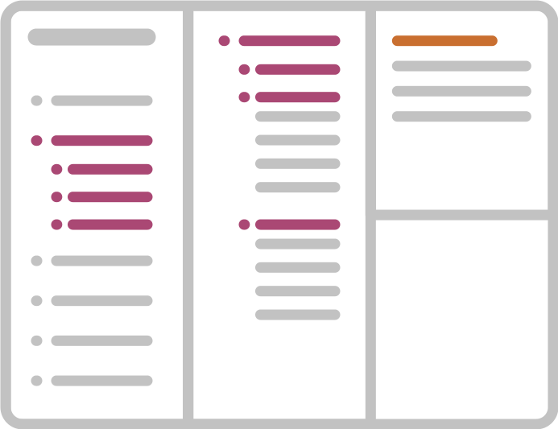
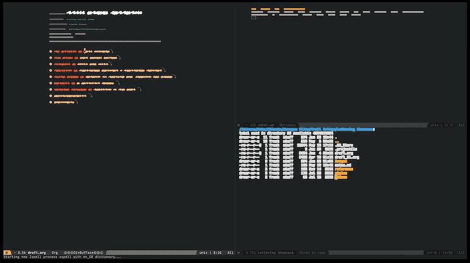

<h1>Emacs For Writers</h1>

[Installation](#install-this-configuration-file) | [Introduction](docs/intro.md) | [Keyboard Shortcuts](docs/shortcuts.md) | [System Requirements](docs/requirements.md) | [Project Management](docs/projects.md) | [Caveats](docs/caveats.md) | [Tips](docs/tips.md)

***

Got some value out of this? Want to support further versions?

***

## Intent

1. To get writers without an overbearing amount of tech literacy set up with a tool otherwise prohibitive for them to get started with. 
2. Show an easy to follow step-by-step guide to install and configure the most powerful writing environment to date. 
3. Provide a ready-made Emacs configuration, geared towards writers.

And most importantly, to get you started quickly and save you the countless hours I’ve spent digging through all of this. This configuration is intended as a starting point on your journey. No system is ever finished and this puts you in the driver’s seat.

***

## What is this?

With this `.spacemacs` Emacs configuration you're looking at about 90% of my personal Emacs setup. The rest is comprised of functions too specific to include in a public releases. It won't affect regular use at all. 

I'm sharing this because I've struggled at the beginning to get Emacs set-up the way I wanted it to be and actually have it work the way I intended it to. Since then it freed me up in my writing, planning and collaboration tasks immensely.

If you're a writer who's not shy about a little bit of a challenge and you want to give your workflow a boost, this might be for you.

## Who this is for

> Nothing worth having is ever going to come easy.

- If you're bothered by word processors constantly getting in your way and messing with the way *you* want to express yourself, what words you can use, this is for you.
- If you've used Markdown apps before and want something more, this is for you. Emacs does Markdown very well, but once you've used `org-mode` for a bit, you're hooked.
- If you're not afraid of a little work to set up your tool in exchange of a vast new world, this is for you.
- If you want to create the way your writing is managed instead of cookie cutter setups, this is for you.

But my editor requires Word files! Fret not, you can export to Word documents via `org-mode`'s various export options. Fortunately editing is at the end of the writing process when 80% of your decisions have been made. What if your editor wants you to do a long rewrite *with* them? Well, shit. You have my pity. It's Word-time at that point unless you have a say in work-flow. One really powerful way to work with remote editors is to link *their* document into one panel (from a cloud service) and yours adjacent to it and vice versa on the other end. The moment they save their file (with a brief delay) your "inbox" panel updates. A symbolic link to a shared cloud folder is one way to do this. You can't get your editor to use GIT, not going to happen. Here's more on [working with an editor](https://www.masteringemacs.org/article/how-to-write-a-book-in-emacs). 

***

<pre>
<q>I’ve got no strings to hold me down
To make me fret, or make me frown
I had strings, but now I'm free
There are no strings on me</q>
</pre>

***

## Who this is not for

> This Emacs setup is optimised towards a graphical user interface, its installation however requires some work under the hood. It's worth learning, though as you paid for that part of the OS as well. So why not use it?

- If you're new to computers and a bit skittish about learning new things, don't. Or get help you can call on for getting it set up and doing your first exports.
- If you have a fear of the command-line because of things you have seen or heard online about people wiping their entire hard drive from it, don't. Learn a little bit about the command-line first and also stop running everything as administrator.

Keep in mind, just because it's not for you right now doesn't mean it's not for you at all. Give it time, learn a little about the things that keep you from it now and just come back to the topic later on. Emacs has been around for 40 years, it'll be still be around in a few weeks. If it interest you but you feel uneasy about the little steps beforehand, just keep learning bit by bit. No rush. It's like working out, just for your mind.
 

## Intro to Emacs

Emacs for ages has been known to be more of a science-focused editor. A programmer's toolkit. More and more writers have been turning towards it over the decades for its flexibility and ergonomics. Also for its speed. Once everything is loaded it's hard to slow it down. This setup for example has a loading time of around 5 seconds on first boot. Subsequent program launches (when you quit the app) within one session only cost around 3 seconds.

If you’re not familiar with [Emacs](https://en.wikipedia.org/wiki/Emacs), I’d describe it as an *operating system for text*. With 40 years in the making it’s probably the oldest editor still around and being actively developed.

With tools as vast as Emacs or to some extend [Vim](https://en.wikipedia.org/wiki/Vim_(text_editor)), there isn’t a learning curve, there’s a learning lifestyle. You always end up finding new and better ways to do something more efficiently. And then you look up and the next day is dawning. 🤷

### What’s the benefit for writers?

Once you've tasted the power and freedom of interpreted plain-text files, Markdown soon won’t be enough. I still use it plenty though. Mostly because there’s nothing like iA Writer for org-mode files on the mobile side of 	things. Emacs is almost entirely keyboard driven. Any command you can think of to work with text is right at your fingertips. You have two main modes, one where you write in (insert mode) and one where you do everything else (normal mode) with your text. There's also an `overwrite-mode` that you can call on to just write over anything you've typed before. On some systems the `insert` key triggers that mode.

Your hands, for the most part stay fairly centred on the keyboard. At least with a US keyboard layout and to some extend with a UK layout. Fortunately, any command can be bound to any key you like, so you can make it completely yours no matter what keyboard layout you use.

The biggest benefit, at least for me however is the organisational power it exhibits. You can link documents together in a clean hierarchy, then change it all up again. 

### Why this setup?

When I first started to look into Emacs, it was because of [this video](https://www.youtube.com/watch?v=FtieBc3KptU). This project is named as a nod to Jay Dixit’s presentation. Before that, my experiences with either Emacs or Vim were more along the lines “How do I quit this?”.

I've tried a lot of writing apps, spent a lot of money in the progress. The main thing I've learned is what I don't like. The surviving group is comprised of these four, ranked in order of use.

1. Emacs
2. MacVim
3. iA Writer (iOS and macOS)
4. Final Draft (iOS and macOS)

A big part for moving to Emacs was the Odyssey of feature requests. Most of the time you can forget about a feature request you submit ever making it to the app you’re using. At best you get what you’re after months later. With Emacs you can just make the feature yourself. Yes it’s coding, but most of the time you’re just stringing existing commands together and reading items into variables. Arduous, repetitive tasks become a matter of pressing one key fairly soon.

***

## Get started!

There are a myriad of Emacs distributions. Some a simple as downloading an installer, others as complicated as compiling from source code. I found a middle ground to be working the best for me. *[Homebrew](https://brew.sh)* lets you install virtually any Unix/Linux app on your Mac. Keep in mind, macOS comes with a version of Emacs but it’s more of a “hey, it’s there” version. *Emacs Plus* will give you a nice desktop app with a crazy amount of customisability. In fact you can change pretty much anything you see and how it behaves.

### Ready-made Emacs distributions

If you easily fret when it comes to a little extra work when setting up apps, here are a few ready-made versions. I do not know whether everything will work in them as I have not used these in a very long time. You’re on your own there, ranger.

- [Emacs for Mac OS X](https://emacsformacosx.com)
- [Aquamacs](http://aquamacs.org)
- [On Windows](https://www.gnu.org/software/emacs/download.html) - I have absolutely no idea about this one. If you try it, let me know how it goes.

### “Proper” Emacs

- Emacs distribution (Mac)
https://github.com/d12frosted/homebrew-emacs-plus

For future ease of use, if you don't have [Homebrew](https://brew.sh) installed yet, let's do that now. Open your Terminal app. Hit the keys <kbd>[COMMAND]</kbd> + <kbd>[SPACEBAR]</kbd> together and start typing `Terminal` in the search field. Once it comes up selected you can just hit enter.

Copy and paste this line into your Terminal and hit enter.

> `/usr/bin/ruby -e "$(curl -fsSL https://raw.githubusercontent.com/Homebrew/install/master/install)"`

Now you wait until it's done. Do absolutely nothing to that Terminal window now and don't hit any keys. It'll tell you when it's done.

Once that's done, we can swiftly install Emacs.

First, tell Homebrew where to find it.
> `brew tap d12frosted/emacs-plus`

Install it and its dependencies. This can take a while. Lean back and enjoy the show. The `--with-no-titlebar` flag lets you use the entire screen without the usual *title bar* that windows normally have. Together with my config you boot Emacs into a big-ass slate on your screen.

> `brew install emacs-plus --with-no-titlebar`

Now use a foundational configuration to get you stated into something nice. We're going with [Spacemacs](http://spacemacs.org/) here. There's also [Doom](https://github.com/hlissner/doom-emacs) but Spacemacs is just an easier entry. Did I mention Emacs can be anything you want? This is a prime example.

Copy and paste this line to your commandline and hit enter.

> `git clone https://github.com/syl20bnr/spacemacs ~/.emacs.d`

It will now download the Spacemacs configuration to your local Emacs configuration folder. Once that's done, run Emacs to check if everything is OK. You'll be asked how you want to use it. For this config file to work right, choose the following.

- **Evil**
	Evil brings Vim keyboard shortcuts to Emacs. Often helpful but my config shows how you can disable the annoying ones. In general it's a good idea if you use both Vim and Emacs to stick with Evil mode. Emacs has more ergonomic text navigation *while* writing though, so we're disabling the Evil keys for that.

- **Ivy**
	Ivy is a nimble auto-completion front-end for your search and search-like activity around Emacs. It's more lightweight than Helm and an easier entry as it doesn't get in the way.

### Install this configuration file

If you know how to use git, you already know how to use dotfiles, this one goes into your user home directory.

If you’re new to this, there’s a desktop way as well. Click on the big green button above and choose `Download ZIP`. Go to your downloads folder and double click the `.zip` file. Open the resulting folder and press <kbd>COMMAND</kbd> + <kbd>SHIFT</kbd> + <kbd>.</kbd>. This will show the hidden files, AKA “dotfiles”. Pressing them again will reverse the effect. Now just drag the `.spacemacs` file to your home folder. If everything went correctly before, you’ll be asked if you want to overwrite the existing file. Say no and go to your home folder, rename the `.spacemacs` file there into something like `.spacemacs_backup` so you have the base configuration to fall back to. Now drag it over from where we were a few seconds earlier.

## Org-mode: What is it?

In essence, `org-mode` is an outliner (and so much more). You structure your thoughts and then you flesh them out more and more until you’ve reached your final product. The main way it differs from other outliners is its vast extensibility and openness. Can’t do something you want? Someone either already has made an extension for it or you can make your own. How is it open? It’s a plaintext file. You’ll always be able to open and edit your old documents. *Vim*, *nano*, *micro*, *TextEdit*, anything that can open a text file will be able to open a .org file. You might need to rename it but your work is never lost.

## Org-mode: Getting started

This is the mother lode. A rabbit-hole with rabbit-holes along the way. You may find [this introduction](https://www.youtube.com/watch?v=PVsSOmUB7ic
) more helpful than a treatise on the benefits of this writing mode.

Just a few points that I particularly enjoy about working in `org-mode`.

- A fast and efficient outliner
- Extensible to the n-th degree
- Plaintext all the way, no strings to hold you down
- Can display images in-line and export them just the same

### Org-anisation (yes I really went there)

> A few things worth knowing. 

You can use Org-mode to link several files together in one outline and have it export as one big document. Like a book for example. You can also [have code](https://orgmode.org/manual/Literal-examples.html) in your outline that gets executed upon export, or just is displayed with syntax colouring. Useful when you’re writing for games or another larger writing group where you either pull items from a database or generate blocks of text on the fly for serialisation as an example. Or maybe you just want dialogue formatting in your outline. Pick a format and reference it as a code block.

As big and complex as org-mode sounds (and is), you’re still dealing with a plaintext file that you’ll always be able to read and edit, no matter what. No “this version of the document isn’t supported by this version of the app” or other nonsense like that. Your work is yours, always.

 
